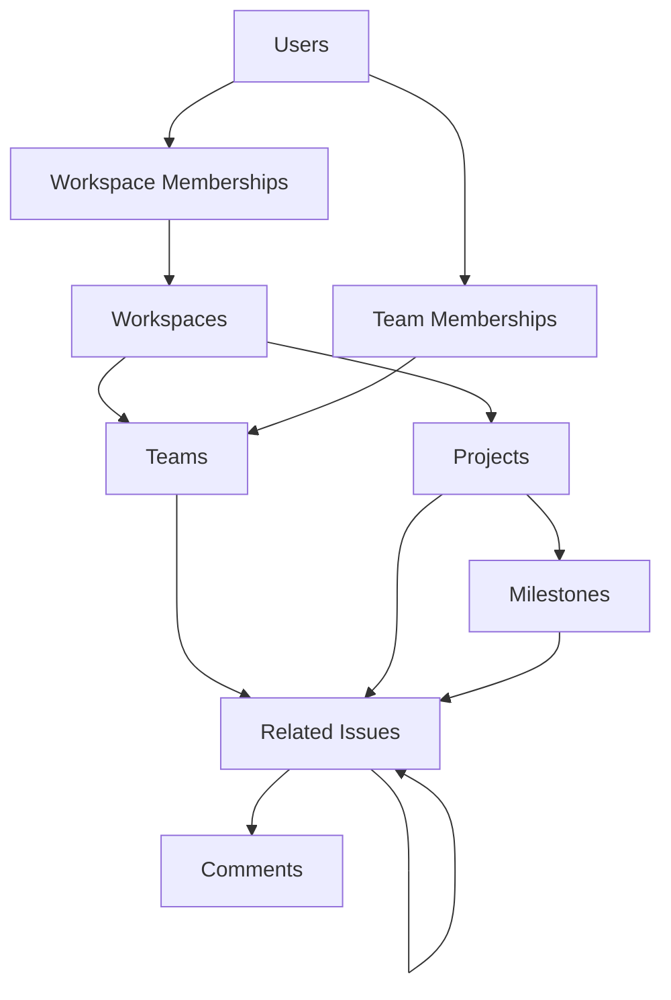

# Issue Tracker Database Repository

## Overview

This repository contains the complete database schema, TypeScript type definitions, and query templates for a modern issue tracking system similar to Linear/Jira. It's designed as a **private repository** separate from the main application to protect database structure and maintain clean separation of concerns.

## 🏗️ Repository Structure

```
├── db/                     # Database SQL files
│   ├── schema/            # Table definitions and constraints
│   ├── seeds/             # Initial data for development
│   ├── queries/           # Prepared SQL query templates
│   └── setup.sql          # Master script to initialize database
│
├── types/                 # TypeScript type definitions
│   ├── entities/          # Core business objects (match DB tables)
│   ├── enums/            # Type constraints (match SQL CHECK constraints)
│   ├── relationships/     # Junction table types
│   └── api/              # Composed API response types
│
└── data/                  # JSON seed data for testing
    └── *.json            # Sample data matching TypeScript types
```

## 📊 Database Architecture

### Core Entities

The system is built around these primary tables:

- **Users** - OAuth-compatible user accounts with role assignments
- **Workspaces** - Top-level organizational units
- **Teams** - Groups within workspaces with optional estimation settings
- **Projects** - Initiatives that can span teams
- **Milestones** - Project checkpoints with progress tracking
- **Issues** - Core work items with draft/published states
- **Comments** - Threaded discussions on issues
- **Links** - External URLs attached to issues

### Key Features

1. **Multi-tenancy**: Row-Level Security (RLS) ensures data isolation between workspaces
2. **Flexible Permissions**: Role-based access with workspace and global scopes
3. **Issue States**: Draft/Published workflow for issue creation
4. **Estimation**: Optional team-level estimation (Fibonacci, T-shirt sizes, etc.)
5. **Audit Trail**: Event log for role assignments and changes
6. **Bidirectional Relations**: Automatic maintenance of related issues

### Database Relationships



## 🔧 Technical Implementation

### SQL Schema (`db/schema/`)

Files are numbered for ordered execution:
- `001-003`: Core setup (roles, workspaces, users)
- `004-006`: Organization (teams, projects, milestones)
- `007-010`: Issues and metadata
- `011-015`: Relationships and junction tables
- `016-019`: Indexes and optimizations
- `020-024`: Memberships and RLS policies

### TypeScript Types (`types/`)

#### `/entities`
Direct 1:1 mappings to database tables:
```typescript
interface Issue {
  id: string;              // UUID
  publicId: string;        // "ISSUE-01" or "DRAFT"
  workspaceId: string;     // Required for RLS
  teamId?: string;         // Optional team association
  issueState: IssueState;  // "draft" | "published"
  estimation?: number;     // 1-6, when team has estimation
  // ...
}
```

#### `/enums`
Type constraints matching SQL CHECK constraints:
```typescript
type Priority = "no-priority" | "urgent" | "high" | "medium" | "low";
type Status = "triage" | "backlog" | "todo" | "in-progress" | "done" | ...;
```

#### `/relationships`
Junction tables with additional metadata:
```typescript
interface TeamMembership {
  id: string;
  userId: string;
  teamId: string;
  role: TeamRole;  // "lead" | "member" | "viewer"
  joinedAt: Date;
}
```

#### `/api`
Composed types for optimized API responses:
```typescript
interface UserDashboardResponse {
  user: User;
  workspaces: Array<{
    membership: WorkspaceMembership;
    workspace: Workspace;
  }>;
  teams: Array<{
    membership: TeamMembership;
    team: Team;
  }>;
}
```

## 🚀 Setup Instructions

### Initialize Database

```bash
# Connect to PostgreSQL
psql -U your_user -d your_database

# Run the complete setup
\i db/setup.sql
```

This will:
1. Create all tables with proper constraints
2. Set up indexes and triggers
3. Enable Row-Level Security
4. Create views and functions
5. Insert initial seed data

### Manual Setup (if needed)

```bash
# Run schema files in order
for file in db/schema/*.sql; do
  psql -U user -d database -f "$file"
done

# Then run seeds
for file in db/seeds/*.sql; do
  psql -U user -d database -f "$file"
done
```

## 🔐 Security Features

### Row-Level Security (RLS)

All main tables have RLS policies ensuring users can only access:
- Workspaces they're members of
- Teams within their workspaces
- Issues within their teams (or workspace-level)
- Projects they have access to

Example policy:
```sql
CREATE POLICY workspace_access ON workspaces
  FOR ALL
  USING (
    id IN (
      SELECT workspace_id 
      FROM workspace_memberships 
      WHERE user_id = current_setting('app.current_user')::text
    )
  );
```

### Role Management

Dynamic role assignment with audit trail:
- System roles (global): `super_admin`, `beta_tester`, `developer`, `support_staff`
- Workspace roles: `owner`, `admin`, `member`, `guest`
- Team roles: `lead`, `member`, `viewer`
- Custom workspace-specific roles supported

## 📝 Query Templates (`db/queries/`)

Pre-written, parameterized queries for common operations:

```sql
-- Get issue with all details
SELECT id, public_id, workspace_id, team_id, project_id, milestone_id,
       priority, status, issue_state, title, description, creator_id, 
       parent_issue_id, due_date, assignee_id, created_at, updated_at
FROM issues 
WHERE id = $1;
```

## 🔄 Data Flow

### Issue Lifecycle

1. **Draft Creation**: Issues start as drafts with `publicId = "DRAFT"`
2. **Publishing**: When published, receive sequential ID like `"ISSUE-04"`
3. **Collaboration**: Comments, reactions, subscriptions can be added
4. **Tracking**: Milestones track progress via aggregated issue statuses

### Workspace Hierarchy

```
Workspace (e.g., "Interesting Workspace")
├── Teams (e.g., "Engineering", "Design")
│   └── Team Members with roles
├── Projects (can be workspace or team-level)
│   └── Milestones with progress tracking
└── Issues (can be at any level)
    ├── Sub-issues (via parentIssueId)
    ├── Comments (threaded)
    └── Attachments (links)
```

## 🎯 Best Practices

### When Adding New Features

1. **Schema First**: Create SQL table definition in `db/schema/`
2. **Types Second**: Add TypeScript interface in appropriate `types/` subfolder
3. **Queries Third**: Add query templates in `db/queries/`
4. **Seeds Last**: Update seed data if needed

### Naming Conventions

- **SQL**: snake_case for tables/columns, UUID for IDs
- **TypeScript**: camelCase for properties, PascalCase for types
- **Public IDs**: Human-readable format like `ISSUE-01`, `PROJ-001`

### Type Safety

- TypeScript types are source of truth for frontend
- SQL constraints ensure data integrity at database level
- API types compose entities for efficient data fetching

## 🔍 For LLM Context

When using this repository as context for AI assistants:

1. **Key Invariants**:
   - Issues have two states: `draft` (publicId="DRAFT") and `published` (publicId="ISSUE-XX")
   - Milestones belong to projects (never standalone)
   - Teams belong to workspaces
   - User IDs are VARCHAR(50) for OAuth compatibility, everything else uses UUID

2. **Removed Features**:
   - No `parent_comment_id` in issues (feature was removed)
   - No creating issues from comments

3. **Special Patterns**:
   - Role assignments use event log pattern (not simple junction table)
   - Related issues use bidirectional triggers for consistency
   - Estimation is team-level setting, not per-issue

4. **Query Patterns**:
   - Use prepared statements with $1, $2 placeholders
   - JOINs are preferred over multiple queries
   - API responses use composed types for efficiency

## 📚 Additional Notes

- **No ORM**: Direct SQL for maximum performance and control
- **Type Generation**: Consider using tools like `pg-to-ts` for automatic type generation from schema
- **Migrations**: Not included - use your preferred migration tool (Flyway, Liquibase, etc.)
- **Testing**: Seed data in `data/` provides consistent test scenarios

## 🤝 Contributing

When modifying the schema:
1. Ensure TypeScript types match exactly
2. Update relevant query templates
3. Test with fresh database initialization
4. Verify RLS policies still work correctly
5. Update seed data if structure changes

## 📄 License

[Private Repository - Internal Use Only]