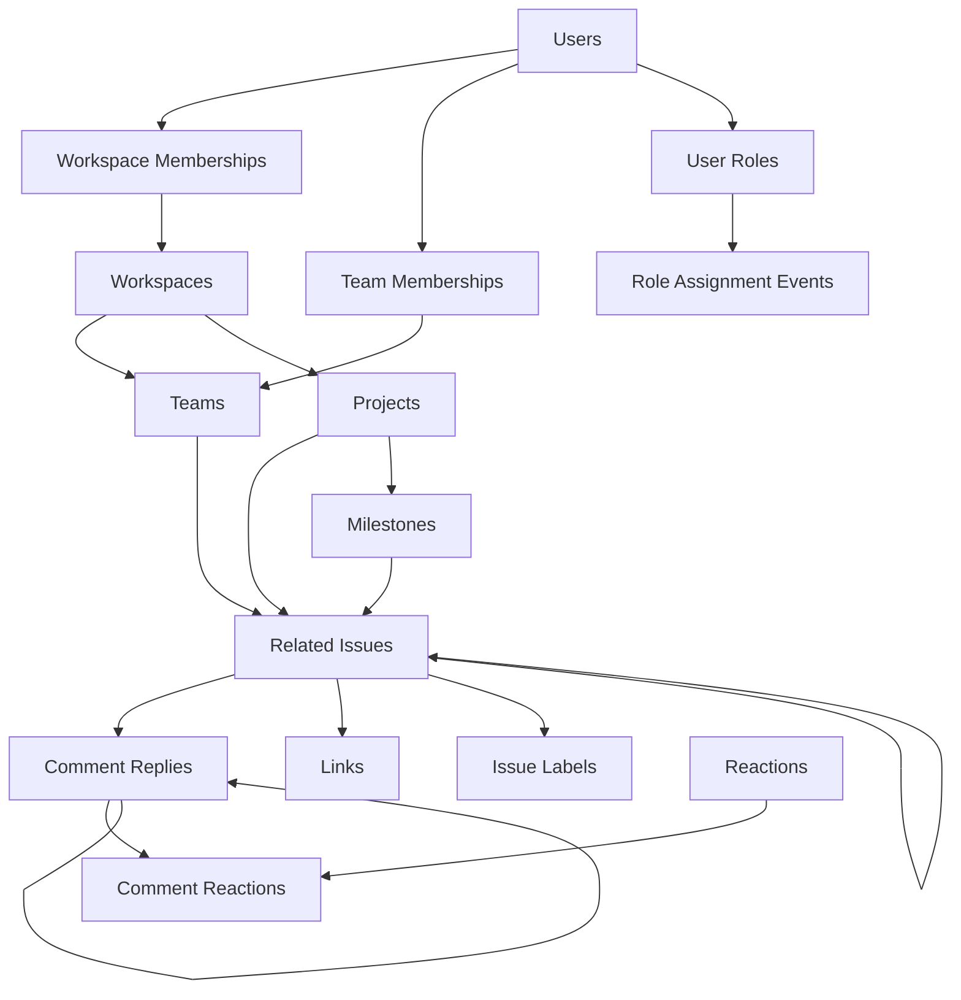

# Issue Tracker Database Repository

## Overview

This repository contains the complete database schema, TypeScript type definitions, and query templates for a modern issue tracking system. It's designed as a **private repository** separate from the main application to protect database structure and maintain clean separation of concerns.

## 🏗️ Repository Structure

```
├── db/                     # Database SQL files
│   ├── schema/            # Table definitions and constraints (24 files)
│   ├── seeds/             # Initial data for development (20 files)
│   ├── queries/           # Prepared SQL query templates
│   └── setup.sql          # Master script to initialize database
│
├── types/                 # TypeScript type definitions
│   ├── entities/          # Core business objects (match DB tables)
│   ├── enums/            # Type constraints (match SQL CHECK constraints)
│   ├── relationships/     # Junction table types
│   └── api/              # Composed API response types
│
└── data/                  # JSON seed data for testing (20 files)
    └── *.json            # Sample data matching TypeScript types
```

## 📊 Database Architecture

### Core Entities

The system is built around these primary tables:

- **Users** - OAuth-compatible user accounts with role assignments
- **Workspaces** - Top-level organizational units
- **Teams** - Groups within workspaces with optional estimation settings
- **Projects** - Initiatives that can span teams
- **Milestones** - Project checkpoints with progress tracking
- **Issues** - Core work items with draft/published states
- **Comments** - Threaded discussions on issues with reactions
- **Links** - External URLs attached to issues
- **Reactions** - Emoji reactions for comments
- **User Roles** - Dynamic permission system with event logging

### Key Features

1. **Multi-tenancy**: Row-Level Security (RLS) ensures data isolation between workspaces
2. **Flexible Permissions**: Role-based access with workspace and global scopes
3. **Issue States**: Draft/Published workflow for issue creation
4. **Estimation**: Optional team-level estimation (Fibonacci, T-shirt sizes, etc.)
5. **Audit Trail**: Event log for role assignments and changes
6. **Bidirectional Relations**: Automatic maintenance of related issues
7. **Comment Threading**: Support for nested comment replies
8. **Reaction System**: Emoji reactions on comments with aggregation

### Database Relationships



## 🎯 Repository Consistency Analysis

### ✅ **Verified Consistency - All Systems Coherent**

After comprehensive analysis, this repository demonstrates **exceptional consistency** across all layers:

#### **1. Schema and Data Alignment**
- ✅ All JSON data files match their corresponding SQL schema perfectly
- ✅ UUID and VARCHAR types are used consistently throughout
- ✅ All foreign key relationships reference valid, existing records
- ✅ No orphaned records or dangling references

#### **2. TypeScript Type Safety**
- ✅ Entity types correctly reflect database tables (1:1 mapping)
- ✅ Relationship types match junction tables exactly
- ✅ API response types properly compose base entities
- ✅ Enum types match SQL CHECK constraints precisely

#### **3. Data Integrity Verification**
- ✅ Draft issues correctly use "DRAFT" as publicId
- ✅ Published issues have sequential ISSUE-XX IDs
- ✅ Bidirectional relationships (issue_related_issues) properly maintained
- ✅ All reactions reference valid reaction types
- ✅ Comment threading maintains proper parent-child relationships

#### **4. Business Logic Consistency**
- ✅ Teams with `withEstimation=true` have issues with estimation values (1-6)
- ✅ Teams with `withEstimation=false` have issues without estimation
- ✅ Milestones only exist on projects (never standalone)
- ✅ Workspace-specific roles are properly scoped
- ✅ User role assignments track complete history in event log

### 📊 **Test Data Statistics**

The repository includes comprehensive test data:
- **5 users** with diverse roles and permissions
- **2 workspaces** with proper membership hierarchies
- **3 teams** with different estimation configurations
- **14 issues** (12 published, 2 drafts) demonstrating all states
- **3 comments** with reactions and threading
- **2 projects** with associated milestones
- **6 links** across different issues
- **4 issue labels** (workspace and team-scoped)
- **12 reactions** available for comments
- **Proper distribution** of subscriptions, favorites, and relationships

## 🔧 Technical Implementation

### SQL Schema (`db/schema/`)

Files are numbered for ordered execution (24 total files):
- `001`: User roles table with permissions system
- `002-003`: Core setup (workspaces, users)
- `004-006`: Organization (teams, projects, milestones)
- `007-010`: Issues, comments, labels, reactions
- `011-015`: Relationships and junction tables
- `016`: Performance indexes
- `017-018`: Links and related issues
- `019-020`: Membership tables
- `021`: Row-Level Security policies
- `022`: Milestone statistics view
- `023`: User role assignment events (audit log)

### TypeScript Types (`types/`)

#### `/entities` (13 types)
Direct 1:1 mappings to database tables:
```typescript
interface Issue {
  id: string;              // UUID
  publicId: string;        // "ISSUE-01" or "DRAFT"
  workspaceId: string;     // Required for RLS
  teamId?: string;         // Optional team association
  projectId?: string;      // Optional project association
  milestoneId?: string;    // Only if in project
  issueState: IssueState;  // "draft" | "published"
  estimation?: number;     // 1-6, when team has estimation
  // ...
}
```

#### `/enums` (9 types)
Type constraints matching SQL CHECK constraints:
```typescript
type Priority = "no-priority" | "urgent" | "high" | "medium" | "low";
type Status = "triage" | "backlog" | "todo" | "planning" | "in-progress" 
            | "in-review" | "done" | "commit" | "canceled" | "decline" | "duplicate";
type EstimationType = "exponential" | "fibonacci" | "linear" | "tshirt" | "bouldering";
type WorkspaceRole = "owner" | "admin" | "member" | "guest";
type TeamRole = "lead" | "member" | "viewer";
```

#### `/relationships` (8 types)
Junction tables with additional metadata:
```typescript
interface TeamMembership {
  id: string;
  userId: string;
  teamId: string;
  role: TeamRole;  // "lead" | "member" | "viewer"
  joinedAt: Date;
}

interface CommentReaction {
  userId: string;
  commentId: string;
  reactionId: string;
  reactedAt: Date;
}
```

#### `/api` (8 types)
Composed types for optimized API responses:
```typescript
interface UserDashboardResponse {
  user: User;
  workspaces: Array<{
    membership: WorkspaceMembership;
    workspace: Workspace;
  }>;
  teams: Array<{
    membership: TeamMembership;
    team: Team;
  }>;
}

interface IssueWithDetails {
  issue: Issue;
  creator: User;
  assignee?: User;
  labels: IssueLabel[];
  comments: Comment[];
  subscribers: User[];
  links: Link[];
  parentIssue?: Issue;
  subIssues?: Issue[];
  relatedIssues?: Issue[];
}
```

## 🚀 Setup Instructions

### Initialize Database

```bash
# Connect to PostgreSQL
psql -U your_user -d your_database

# Run the complete setup
\i db/setup.sql
```

This will:
1. Create all tables with proper constraints
2. Set up indexes and triggers
3. Enable Row-Level Security
4. Create views and functions (including milestone_stats)
5. Insert initial seed data (20 seed files)

### Manual Setup (if needed)

```bash
# Run schema files in order
for file in db/schema/*.sql; do
  psql -U user -d database -f "$file"
done

# Then run seeds
for file in db/seeds/*.sql; do
  psql -U user -d database -f "$file"
done
```

## 🔐 Security Features

### Row-Level Security (RLS)

All main tables have RLS policies ensuring users can only access:
- Workspaces they're members of
- Teams within their workspaces
- Issues within their teams (or workspace-level)
- Projects they have access to
- Milestones through their project access

Example policy:
```sql
CREATE POLICY workspace_access ON workspaces
  FOR ALL
  USING (
    id IN (
      SELECT workspace_id 
      FROM workspace_memberships 
      WHERE user_id = current_setting('app.current_user')::text
    )
  );
```

### Role Management with Event Logging

Dynamic role assignment with complete audit trail:
- **System roles (global)**: `super_admin`, `beta_tester`, `developer`, `support_staff`
- **Workspace roles**: `owner`, `admin`, `member`, `guest`
- **Team roles**: `lead`, `member`, `viewer`
- **Custom workspace-specific roles**: Supported with permissions array
- **Event tracking**: All assignments, removals, and expirations logged

The `user_role_assignment_events` table maintains a complete history of all role changes, not just current state.

## 📝 Query Templates (`db/queries/`)

Pre-written, parameterized queries for common operations:

```sql
-- Get issue with all details
SELECT id, public_id, workspace_id, team_id, project_id, milestone_id,
       priority, status, issue_state, title, description, creator_id, 
       parent_issue_id, due_date, assignee_id, estimation, created_at, updated_at
FROM issues 
WHERE id = $1;

-- Get milestone progress (using the view)
SELECT * FROM milestone_stats WHERE milestone_id = $1;

-- Get user with roles history
SELECT urae.*, ur.name, ur.display_name, ur.permissions
FROM user_role_assignment_events urae
JOIN user_roles ur ON urae.role_id = ur.id
WHERE urae.user_id = $1
ORDER BY urae.created_at DESC;
```

## 🔄 Data Flow

### Issue Lifecycle

1. **Draft Creation**: Issues start as drafts with `publicId = "DRAFT"`
2. **Publishing**: When published, receive sequential ID like `"ISSUE-04"`
3. **Collaboration**: Comments, reactions, subscriptions can be added
4. **Tracking**: Milestones track progress via aggregated issue statuses
5. **Linking**: External links and related issues can be attached

### Workspace Hierarchy

```
Workspace (e.g., "Interesting Workspace")
├── Teams (e.g., "Engineering", "Design")
│   ├── Team Members with roles
│   └── Team-specific labels
├── Projects (can be workspace or team-level)
│   └── Milestones with progress tracking
├── Issues (can be at any level)
│   ├── Sub-issues (via parentIssueId)
│   ├── Comments (threaded with reactions)
│   ├── Links (external URLs)
│   └── Labels (workspace or team-scoped)
└── Global Labels (workspace-wide)
```

## 🎯 Best Practices

### When Adding New Features

1. **Schema First**: Create SQL table definition in `db/schema/`
2. **Types Second**: Add TypeScript interface in appropriate `types/` subfolder
3. **Queries Third**: Add query templates in `db/queries/`
4. **Seeds Last**: Update seed data if needed
5. **Test Consistency**: Verify all foreign keys and relationships

### Naming Conventions

- **SQL**: snake_case for tables/columns, UUID for IDs (except users)
- **TypeScript**: camelCase for properties, PascalCase for types
- **Public IDs**: Human-readable format like `ISSUE-01`, `PROJ-001`, `MILE-01`
- **Event IDs**: Descriptive format like `ROLE-EVT-001`

### Type Safety

- TypeScript types are source of truth for frontend
- SQL constraints ensure data integrity at database level
- API types compose entities for efficient data fetching
- Junction tables include metadata (role, joinedAt, etc.)

## 🔍 Key Invariants for Development

When using this repository:

1. **ID Patterns**:
   - User IDs are VARCHAR(50) for OAuth compatibility
   - Everything else uses UUID
   - Public IDs are for human readability only

2. **Issue States**:
   - Draft issues: `publicId = "DRAFT"`, `issueState = "draft"`
   - Published issues: `publicId = "ISSUE-XX"`, `issueState = "published"`
   - Multiple drafts can exist with same publicId

3. **Hierarchical Constraints**:
   - Milestones belong to projects (never standalone)
   - Teams belong to workspaces
   - Issues can be workspace, team, or project level
   - Sub-issues inherit team from parent

4. **Special Patterns**:
   - Role assignments use event log pattern (complete history)
   - Related issues use bidirectional triggers for consistency
   - Estimation is team-level setting, not per-issue
   - Comment reactions are aggregated from junction table

5. **Business Rules**:
   - Estimation values are 1-6 (simplified Fibonacci)
   - Only teams with `withEstimation = true` can have estimated issues
   - Workspace members can see all workspace issues
   - Team-specific issues require team membership

## 📚 Architecture Highlights

### Event Sourcing for Roles
The `user_role_assignment_events` table implements an audit trail pattern, tracking all historical role changes rather than just current state.

### Multi-tenancy with RLS
Row-level security ensures complete data isolation between workspaces while maintaining performant queries.

### Flexible Estimation
Teams can choose from multiple estimation types (Fibonacci, T-shirt sizes, etc.) or disable estimation entirely.

### Draft/Published System
The dual state system with shared "DRAFT" publicId allows multiple draft issues while maintaining unique IDs for published issues.

### Reaction Aggregation
Comment reactions are stored in a junction table but aggregated for API responses, providing both flexibility and performance.

## 🤝 Contributing

When modifying the schema:
1. Ensure TypeScript types match exactly
2. Update relevant query templates
3. Test with fresh database initialization
4. Verify RLS policies still work correctly
5. Update seed data if structure changes
6. Run consistency analysis to verify integrity

## 📄 License

[Private Repository - Internal Use Only]

---

*Last consistency check: All systems verified coherent - no issues found across schema, data, and types.*