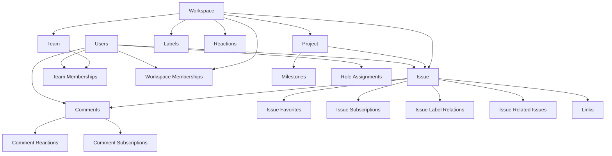

# Data Directory Documentation

## Vue d'ensemble

Ce répertoire `/data` contient des **données mock** au format JSON qui représentent des échantillons d'enregistrements pour chaque table de la base de données. Ces fichiers servent de données de développement et permettent au frontend de fonctionner avant l'implémentation complète du backend et de la base de données réelle.

## Purpose & Usage

### 🎯 Objectifs principaux

1. **Développement Frontend** - Permet de développer l'interface utilisateur sans attendre le backend
2. **Tests & Prototypage** - Fournit des données cohérentes pour les tests et prototypes
3. **Documentation vivante** - Montre la structure exacte des données attendues
4. **Validation des types** - Aide à valider les types TypeScript définis

### 🔧 Utilisation typique

```typescript
// Dans un composant React pendant le développement
import usersData from '../data/users.json';
import workspacesData from '../data/workspaces.json';

function UsersList() {
  // Utilise les données mock en développement
  const users = process.env.NODE_ENV === 'development' 
    ? usersData 
    : await fetchUsers(); // API réelle en production
    
  return (
    <div>
      {users.map(user => (
        <UserCard key={user.id} user={user} />
      ))}
    </div>
  );
}
```

## Structure des fichiers

### 📊 Entités principales (19 fichiers)

#### Core Entities
- **`users.json`** - Utilisateurs du système
- **`workspaces.json`** - Espaces de travail 
- **`teams.json`** - Équipes
- **`projects.json`** - Projets
- **`issues.json`** - Issues/tickets
- **`comments.json`** - Commentaires sur les issues
- **`milestones.json`** - Jalons de projet

#### Labels & Categorization  
- **`issue_labels.json`** - Étiquettes pour les issues
- **`reactions.json`** - Types de réactions (emojis)
- **`links.json`** - Liens/attachements

#### User Management
- **`user_roles.json`** - Rôles utilisateur avec permissions
- **`user_role_assignment_events.json`** - Historique des assignations de rôles

#### Relationship Tables (Junction Tables)
- **`workspace_memberships.json`** - Adhésions aux workspaces
- **`team_memberships.json`** - Adhésions aux équipes
- **`issue_label_relations.json`** - Relations issues ↔ labels
- **`issue_related_issues.json`** - Relations entre issues
- **`issue_favorites.json`** - Issues favorites des utilisateurs
- **`issue_subscriptions.json`** - Abonnements aux issues
- **`comment_reactions.json`** - Réactions sur les commentaires
- **`comment_subscriptions.json`** - Abonnements aux commentaires

## Détails par fichier

### 👤 users.json
```json
{
  "id": "user-1",                    // VARCHAR(50) - ID utilisateur 
  "username": "johndoe",             // VARCHAR(50) - Nom d'utilisateur unique
  "email": "john.doe@example.com",   // VARCHAR(255) - Email unique
  "avatar": "https://...",           // TEXT - URL de l'avatar
  "firstName": "John",               // VARCHAR(100) - Prénom
  "lastName": "Doe",                 // VARCHAR(100) - Nom
  "isOnline": true,                  // BOOLEAN - Status en ligne
  "currentWorkspaceId": "uuid",      // UUID - Workspace actuel
  "roles": ["super_admin"],          // TEXT[] - Rôles globaux
  "createdAt": "2024-01-01T10:00:00Z",
  "updatedAt": "2025-07-10T10:00:00Z"
}
```

**Données d'exemple** : 6 utilisateurs avec différents rôles et profils

### 🏢 workspaces.json
```json
{
  "id": "00000000-0000-0000-0000-000000000001", // UUID
  "publicId": "IW",                  // VARCHAR(10) - ID public court
  "name": "Interesting Workspace",   // VARCHAR(255) - Nom du workspace
  "icon": "🎯",                      // VARCHAR(10) - Emoji d'icône
  "description": "Main workspace...", // TEXT - Description
  "createdAt": "2024-01-01T00:00:00Z",
  "updatedAt": "2024-01-01T00:00:00Z"
}
```

**Données d'exemple** : 2 workspaces ("Interesting Workspace" et "School Manager")

### 👥 teams.json
```json
{
  "id": "11111111-1111-1111-1111-111111111111", // UUID
  "workspaceId": "uuid",             // UUID - Workspace parent
  "name": "Frontend Team",           // VARCHAR(255)
  "icon": "⚛️",                     // VARCHAR(10)
  "description": "React developers", // TEXT
  "createdAt": "2024-01-01T00:00:00Z",
  "updatedAt": "2024-01-01T00:00:00Z"
}
```

**Données d'exemple** : 4 équipes (Frontend, Backend, Design, QA)

### 📂 projects.json
```json
{
  "id": "22222222-2222-2222-2222-222222222221", // UUID
  "workspaceId": "uuid",             // UUID - Workspace parent
  "teamId": "uuid",                  // UUID - Équipe responsable
  "publicId": "PROJ-001",            // VARCHAR(20) - ID public
  "name": "E-commerce Platform",     // VARCHAR(255)
  "icon": "🛒",                      // VARCHAR(10)
  "description": "Online store...",  // TEXT
  "status": "active",                // project_status ENUM
  "leadId": "user-1",                // VARCHAR(50) - Chef de projet
  "startDate": "2024-01-01T00:00:00Z",
  "endDate": "2024-12-31T23:59:59Z",
  "createdAt": "2024-01-01T00:00:00Z",
  "updatedAt": "2024-01-01T00:00:00Z"
}
```

**Données d'exemple** : 4 projets avec différents status et équipes

### 🎯 issues.json
```json
{
  "id": "550e8400-e29b-41d4-a716-446655440001", // UUID
  "publicId": "ISSUE-04",            // VARCHAR(20) - ID public
  "workspaceId": "uuid",             // UUID
  "teamId": "uuid",                  // UUID
  "projectId": "uuid",               // UUID
  "milestoneId": "uuid",             // UUID - Jalon (optionnel)
  "priority": "high",                // priority ENUM
  "status": "in-progress",           // status ENUM  
  "issueState": "published",         // issue_state ENUM
  "title": "Issue title 4",          // VARCHAR(500)
  "description": "## Description...", // TEXT - Markdown
  "creatorId": "user-1",             // VARCHAR(50)
  "parentIssueId": null,             // UUID - Issue parente (optionnel)
  "dueDate": "2025-07-15T10:00:00Z", // TIMESTAMP
  "assigneeId": "user-1",            // VARCHAR(50) - Assigné
  "estimation": 5,                   // INTEGER - Estimation en heures
  "createdAt": "2025-07-01T10:00:00Z",
  "updatedAt": "2025-07-10T14:30:00Z"
}
```

**Données d'exemple** : 12 issues avec différents status, priorités et assignations

### 💬 comments.json
```json
{
  "id": "c0000000-0000-0000-0000-000000000001", // UUID
  "issueId": "uuid",                 // UUID - Issue parent
  "authorId": "user-1",              // VARCHAR(50) - Auteur
  "content": "This looks good to me!", // TEXT - Contenu markdown
  "createdAt": "2025-07-01T11:00:00Z",
  "updatedAt": "2025-07-01T11:00:00Z"
}
```

**Données d'exemple** : 8 commentaires sur différentes issues

### 🏆 milestones.json
```json
{
  "id": "550e8400-e29b-41d4-a716-446655440500", // UUID
  "projectId": "uuid",               // UUID - Projet parent
  "name": "MVP Release",             // VARCHAR(255)
  "description": "First version...", // TEXT
  "dueDate": "2024-03-31T23:59:59Z", // TIMESTAMP
  "status": "active",                // milestone_status ENUM
  "createdAt": "2024-01-01T00:00:00Z",
  "updatedAt": "2024-01-01T00:00:00Z"
}
```

**Données d'exemple** : 4 jalons avec différents status

## Relations & Junction Tables

### 🔗 workspace_memberships.json
```json
{
  "id": "m0000000-0000-0000-0000-000000000001", // UUID
  "userId": "user-1",                // VARCHAR(50)
  "workspaceId": "uuid",             // UUID
  "role": "owner",                   // workspace_role ENUM
  "joinedAt": "2024-01-01T00:00:00Z",
  "invitedBy": null                  // VARCHAR(50) - Qui a invité (NULL = owner)
}
```

**Données d'exemple** : 12 adhésions avec différents rôles

### 👥 team_memberships.json
```json
{
  "id": "tm000000-0000-0000-0000-000000000001", // UUID
  "userId": "user-1",                // VARCHAR(50)
  "teamId": "uuid",                  // UUID
  "role": "admin",                   // team_role ENUM
  "joinedAt": "2024-01-01T00:00:00Z"
}
```

**Données d'exemple** : 8 adhésions aux équipes

### 🏷️ issue_label_relations.json
```json
{
  "issueId": "uuid",                 // UUID
  "labelId": "uuid",                 // UUID
  "createdAt": "2025-07-01T10:00:00Z"
}
```

**Données d'exemple** : 15 relations issues ↔ labels

### ⭐ issue_favorites.json
```json
{
  "userId": "user-2",                // VARCHAR(50)
  "issueId": "uuid",                 // UUID
  "favoritedAt": "2025-07-02T09:00:00Z"
}
```

**Données d'exemple** : 3 issues mises en favoris

### 🔔 issue_subscriptions.json
```json
{
  "userId": "user-2",                // VARCHAR(50)
  "issueId": "uuid",                 // UUID
  "subscribedAt": "2025-07-01T10:30:00Z"
}
```

**Données d'exemple** : 4 abonnements aux issues

## Labels & Reactions

### 🏷️ issue_labels.json
```json
{
  "id": "l0000000-0000-0000-0000-000000000001", // UUID
  "workspaceId": "uuid",             // UUID
  "name": "bug",                     // VARCHAR(50)
  "color": "#d73a49",                // VARCHAR(7) - Code couleur hex
  "description": "Something isn't working", // TEXT
  "createdAt": "2024-01-01T00:00:00Z",
  "updatedAt": "2024-01-01T00:00:00Z"
}
```

**Données d'exemple** : 8 labels (bug, feature, documentation, etc.)

### 😊 reactions.json
```json
{
  "id": "r0000000-0000-0000-0000-000000000001", // UUID
  "workspaceId": "uuid",             // UUID
  "name": "thumbs_up",               // VARCHAR(50)
  "emoji": "👍",                     // VARCHAR(10)
  "createdAt": "2024-01-01T00:00:00Z",
  "updatedAt": "2024-01-01T00:00:00Z"
}
```

**Données d'exemple** : 6 types de réactions (👍👎❤️😄😢😡)

### 😊 comment_reactions.json
```json
{
  "userId": "user-2",                // VARCHAR(50)
  "commentId": "uuid",               // UUID
  "reactionId": "uuid",              // UUID
  "reactedAt": "2025-07-01T11:30:00Z"
}
```

**Données d'exemple** : 3 réactions sur commentaires

## User Roles & Permissions

### 👑 user_roles.json
```json
{
  "id": "role0000-0000-0000-0000-000000000001", // UUID
  "name": "super_admin",             // VARCHAR(50)
  "description": "Full system access", // TEXT
  "permissions": [                   // TEXT[] - Liste des permissions
    "user.create",
    "user.read", 
    "user.update",
    "user.delete",
    "workspace.create"
  ],
  "createdAt": "2024-01-01T00:00:00Z",
  "updatedAt": "2024-01-01T00:00:00Z"
}
```

**Données d'exemple** : 4 rôles (super_admin, workspace_admin, member, guest)

### 📋 user_role_assignment_events.json
```json
{
  "id": "rae00000-0000-0000-0000-000000000001", // UUID
  "userId": "user-1",                // VARCHAR(50)
  "roleId": "uuid",                  // UUID
  "workspaceId": "uuid",             // UUID - Scope du rôle
  "assignedBy": "user-1",            // VARCHAR(50)
  "assignedAt": "2024-01-01T00:00:00Z",
  "expiresAt": null                  // TIMESTAMP - Expiration (optionnel)
}
```

**Données d'exemple** : 6 assignations de rôles avec historique

## Attachments & Links

### 🔗 links.json
```json
{
  "id": "link0000-0000-0000-0000-000000000001", // UUID
  "issueId": "uuid",                 // UUID - Issue parent
  "url": "https://github.com/user/repo/pull/123", // TEXT - URL
  "title": "Fix authentication bug", // VARCHAR(255) - Titre
  "description": "PR that fixes...", // TEXT - Description
  "createdAt": "2025-07-01T12:00:00Z",
  "updatedAt": "2025-07-01T12:00:00Z"
}
```

**Données d'exemple** : 4 liens attachés aux issues

## Relations entre les données

### 🔄 Hierarchies principales



### 🔑 Clés importantes

- **UUID** : Utilisé pour les entités principales (workspaces, teams, projects, issues, etc.)
- **VARCHAR(50)** : Utilisé pour les IDs utilisateur (compatible OAuth)
- **Public IDs** : IDs courts lisibles par humains (ISSUE-04, PROJ-001, IW)
- **Timestamps** : Format ISO 8601 avec timezone UTC
- **Enums** : Valeurs prédéfinies pour status, priority, roles, etc.

## Bonnes pratiques d'utilisation

### ✅ Recommandations

1. **Développement** : Utilisez ces données pour le développement local
2. **Tests** : Réutilisez ces structures pour vos tests unitaires  
3. **Validation** : Vérifiez que vos types TypeScript correspondent
4. **Migration** : Utilisez ces données comme base pour les seeds de base de données

### ❌ À éviter

1. **Production** : Ne jamais utiliser ces données en production
2. **Modification directe** : Préférez regénérer plutôt que modifier manuellement
3. **Données sensibles** : Aucune donnée réelle ne doit être ajoutée ici

### 🔄 Mise à jour

Quand vous modifiez la structure de la base de données :

1. Mettez à jour les types TypeScript correspondants
2. Mettez à jour les fichiers JSON avec la nouvelle structure
3. Vérifiez que les relations restent cohérentes
4. Testez avec le frontend pour validation

---

*Cette documentation est générée automatiquement à partir de la structure des données. Pour toute question sur l'utilisation de ces données mock, consultez l'équipe de développement.*